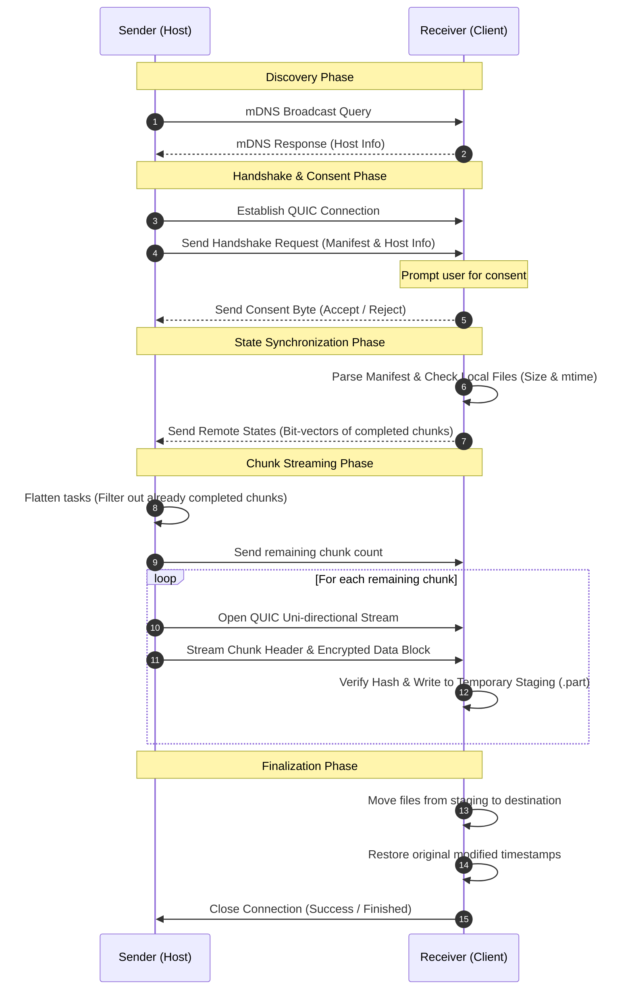
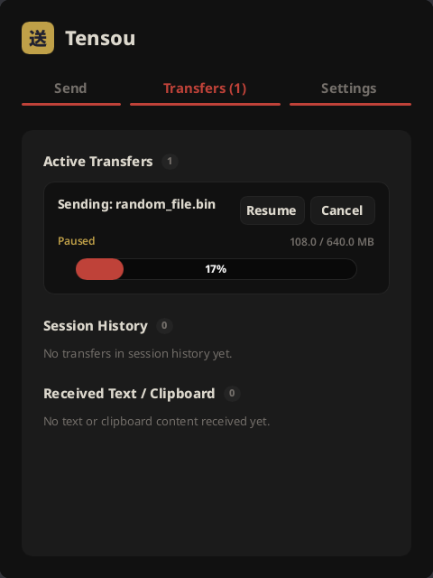
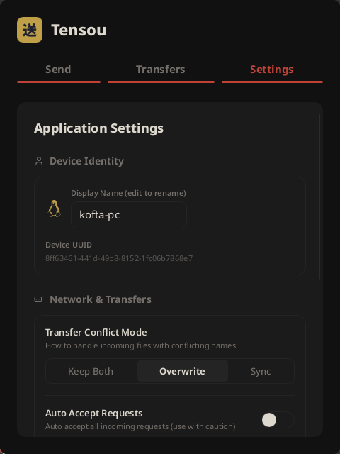
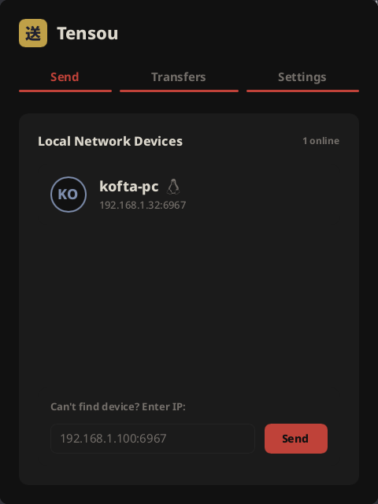

<div align="center">
  
  <h1>Tensou</h1>
  <p>A fast, secure, and lightweight peer-to-peer file transfer utility built with QUIC and Slint</p>
</div>

---

Tensou is a modern peer-to-peer file transfer utility designed for high-performance data migration over local networks. By leveraging the QUIC transport protocol, Tensou achieves near-line-rate speeds with low overhead, secure TLS 1.3 encryption, and robust recovery mechanisms. It offers both a graphical user interface and a developer-friendly command-line interface.

## Key Features

* **QUIC-Based Transport:** Utilizes UDP-based multiplexed connections to eliminate head-of-line blocking and optimize throughput on local networks.
* **mDNS Discovery:** Automatically scans and detects active Tensou devices on the local subnet without requiring manual IP entry.
* **File-Level Differential Sync:** Sync mode skips transmission for files that already exist at the destination with matching sizes and modified timestamps.
* **Resume Support:** Automatically saves state using bit-vector tracking, allowing paused or interrupted transfers to resume exactly where they left off.
* **Dual Interface:** Comes with a desktop graphical user interface built on Slint and a terminal command-line interface.

---

## Comparison with Other Tools

| Feature | Tensou | LocalSend | Dukto | Magic Wormhole |
| :--- | :---: | :---: | :---: | :---: |
| **Transport Protocol** | QUIC (UDP) | HTTP/HTTPS (TCP) | Custom TCP | Custom TCP / Relay |
| **Encryption** | ✅ (TLS 1.3) | ✅ (TLS 1.2/1.3) | None | ✅ (PAKE Symmetric) |
| **Resume Support** | ✅ (Bit-vector) | None | None | None |
| **Differential Sync** | ✅ (Size and mtime) | None | None | None |
| **Automatic Discovery** | ✅ (mDNS) | ✅ (mDNS) | ✅ (UDP Broadcast) | None (needs relay) |
| **Resource Overhead** | Low (Native Rust) | Medium (Flutter/Dart) | Low (C++ / Qt) | Low (Python/Go/Rust) |
| **Offline Operation** | ✅ (Local Only) | ✅ (Local Only) | ✅ (Local Only) | None (needs internet) |

---

## Architecture Diagram

The diagram below outlines the interaction between the sender and receiver during a typical transfer workflow:



---

## Screenshots

<p align="center">
  
  
  
</p>

---

## Installation

### From Source

Ensure you have Rust and Cargo installed (Rust 1.75 or later is required).

```bash
# Clone the repository
git clone https://github.com/kofta999/tensou.git
cd tensou

# Build in release mode
cargo build --release
```

The compiled binaries will be available in `target/release/`.

---

## Usage

### Graphical User Interface (GUI)

To launch the desktop interface, run the binary without any arguments:

```bash
./target/release/tensou
```

### Command-Line Interface (CLI)

The CLI supports both sending and receiving files directly from the terminal.

#### Sending Files

Specify one or more files/folders to send. The CLI will automatically advertise the transfer on mDNS:

```bash
# Send a single file
tensou send path/to/file.zip

# Send multiple files and directories
tensou send folder1/ file2.txt

# Send to a specific IP address directly (bypasses discovery)
tensou send path/to/file.zip --ip 192.168.1.50
```

#### Receiving Files

Start the receiver daemon to listen for incoming transfer requests:

```bash
# Listen using default settings
tensou receive

# Listen and save files to a custom folder
tensou receive --output /path/to/save/directory

# Listen on a custom port
tensou receive --port 8080
```

---

## Roadmap

- [ ] Fix edge-case race conditions during rapid pause and resume events
- [ ] Fix aborted connections being incorrectly classified as general errors rather than connection suspensions
- [ ] Resolve deadlocks occurring when synchronization completes immediately at the start of a transfer
- [ ] Optimize chunk disk writing throughput by tuning system buffer flushing
- [ ] Add option for deletion propagation in Sync mode (removing files at the destination that no longer exist at the source)
- [ ] Implement parallel file scanning on the sender side during manifest generation
- [ ] Build and package binaries for macOS and Windows
- [ ] Develop an Android client to enable mobile-to-desktop and mobile-to-mobile transfers
